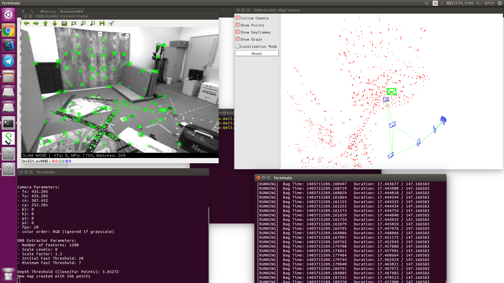

# Homework 3 [Laboratorio Ciberfisico] - University of Verona #

### Descrizione
L'homework 3 è composto da 4 parti:
* Parte 1: installazione di ORB_SLAM2
* Parte 2: esecuzione di ORB_SLAM2 su una rosbag registrata con un drone volante
* Parte 3: creazione di una point-cloud 
* Parte 4: clustering dei punti contenuti nella point-cloud generata al punto 3

### Istruzioni per l'installazione
I punti 1, 2 e 3 sono tutte inglobate in questo repository, tuttavia occorre aver installato la libreria esterna `Pangolin` (si vedano le [istruzioni di ORB_SLAM2](ORB_SLAM2/README.md) per maggiori informazioni).

```sh
$ git clone https://github.com/snukneLeo/homework3.git
```
Posizionarsi nella directory homework3 e lanciare lo script "build.sh" con il comando:
```sh
$ ./build.sh
```
il quale provvederà a compilare tutti i pacchetti necessari.
Successivamente lanciare lo script `run.sh` che servirà per eseguire gli script di ros.
```sh
$ ./run.sh
```
#### Nota:
```sh
Attenzione! Se necessario modificare il path per la ricerca della cartella ORB_SLAM2 e della bag 'V1_01_easy.bag' nello script 'run.sh'
```

### Preview
Una volta avviato lo script `run.sh` compariranno le finestre Map Viewer, Current Frame e un terminale per la bag nel quale bisogna premere spazio (premere la space-bar) per passare da pause a running.

Successivamente occorre attendere che la bag venga eseguita fino alla fine, dopodiché usare la combinazione di tasti `Ctrl+C` per chiudere lo script orb_slam (terminale in basso a sinistra) e permettere al software di salvare la mappa.

Infine, per visualizzare la point-cloud, posizionandovi nella directory `homework3`, lanciare il seguente comando:
```sh
$ ./Cluster/build/cluster_extraction pointcloud.pcd
```
### Cluster ###

Oppure

```sh
$ pcl_viewer pointcloud.pcd
```
per visualizzare la mappa senza clustering.
### Mappa pointCloud ###


### Riferimenti ###

* [Course page (prof. Bloisi - Univr)](profs.scienze.univr.it/~bloisi/corsi/ciberfisico.html)

* [Lezione 13: Point Cloud Library](http://profs.scienze.univr.it/~bloisi/corsi/ciberfisico.html#diario)

* [ROS: PCL](http://wiki.ros.org/pcl_ros)

* [ORB_SLAM2](https://github.com/raulmur/ORB_SLAM2)


### Autore ###

* `Testolin Leonardo`, University of Verona (Italy) [leonardo.testolin@studenti.univr.it](mailto:leonardo.testolin@studenti.univr.it)

### Licenza ###
[View License](https://github.com/snukneLeo/homework3/blob/master/LICENSE)